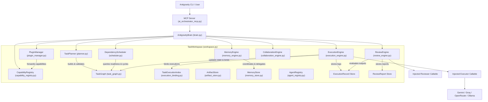

# AI-Orchestrator

**An Operating System Framework for Autonomous AI Agents**

AI-Orchestrator is a capability-driven AI orchestration framework designed to serve as an operating system for AI agents. Built with strict architectural discipline, it features strong typing, explicit data ownership, zero hidden state, explicit dependency injection, and complete separation of concerns across planning, scheduling, and execution.

---

## Current Implementation Status

- **Status**: Capabilities 1–10 COMPLETE & FROZEN (Core v1.0 Foundation Complete)
- **Test Suite**: **121 / 121 tests passing**
- **Architecture**: Frozen & Fully Verified

```
[ Capability 1 ] Task Workspace & Graph         ===> COMPLETE
[ Capability 2 ] Execution Records & Bindings   ===> COMPLETE
[ Capability 3 ] Execution Engine & Lifecycle   ===> COMPLETE
[ Capability 4 ] Dependency Scheduler           ===> COMPLETE
[ Capability 5 ] Intelligent Task Planner       ===> COMPLETE
[ Capability 6 ] Review & Validation Engine    ===> COMPLETE
[ Capability 7 ] Long-Term Memory               ===> COMPLETE
[ Capability 8 ] Result Synthesis Engine       ===> COMPLETE
[ Capability 9 ] Multi-Agent Collaboration      ===> COMPLETE
[ Capability 10] Capability Registry & Plugin  ===> COMPLETE
[ Capabilities 11–20 ] Future Roadmap          ===> NOT IMPLEMENTED
```

---

## Key Architectural Principles

1. **Strict Separation of Concerns**:
   - **Planning NEVER executes.**
   - **Scheduling NEVER plans.**
   - **Execution NEVER plans or schedules.**
   - **Review NEVER executes or schedules.**
   - **Memory NEVER executes, schedules, plans, or reviews.**
   - **Synthesis NEVER executes, schedules, plans, or reviews.**
   - **Multi-Agent Collaboration NEVER executes, schedules, plans, reviews, or synthesizes.**
   - **Capability Registry & Plugins NEVER execute, schedule, plan, review, synthesize, store memory, or coordinate agents.**
2. **Explicit Data Ownership**:
   - `TaskWorkspace` is the sole owner of runtime state (`TaskGraph`, `DependencyScheduler`, `TaskExecutionIndex`, `ArtifactStore`, `ExecutionEngine`, `TaskPlanner`, `ReviewEngine`, `MemoryEngine`, `SynthesisEngine`, `AgentRegistry`, `CollaborationStore`, `CollaborationEngine`, `CapabilityRegistry`, `PluginManager`).
3. **No Hidden State & No Service Locator**:
   - No global singletons. All dependencies are explicitly injected.
4. **Validation Boundary**:
   - Validation is always performed before scheduling or execution via `PlanValidator`.
5. **Deterministic Behaviour**:
   - Synchronous, deterministic state transitions, evaluation, dependency resolution, memory searches, agent message passing, and capability registration.

---

## High-Level System Architecture



---

## Capabilities Overview

| Capability | Title | Key Components | Status |
| :--- | :--- | :--- | :--- |
| **Capability 1** | Task Workspace & Task Graph | `TaskWorkspace`, `TaskGraph`, `TaskNode`, `TaskEdge`, `WorkspaceStore` | **FROZEN** |
| **Capability 2** | Execution Records & Bindings | `ExecutionRecord`, `ExecutionBinding`, `ExecutionType`, `TaskExecutionIndex` | **FROZEN** |
| **Capability 3** | Execution Engine & Lifecycle | `ExecutionEngine`, `ArtifactStore`, `Artifact`, `ExecutionResult`, `ExecutionState` | **FROZEN** |
| **Capability 4** | Dependency Scheduler | `DependencyScheduler`, topological queue, cycle detection, ready/blocked filters | **FROZEN** |
| **Capability 5** | Intelligent Task Planner | `Objective`, `Plan`, `TaskPlanner`, `PlanningEngine`, `PlanValidator`, `PlanVisualizer` | **FROZEN** |
| **Capability 6** | Review & Validation Engine | `ReviewEngine`, `ReviewResult`, `ReviewReport`, `ReviewCriterion`, `ReviewFinding` | **FROZEN** |
| **Capability 7** | Long-Term Memory | `MemoryEngine`, `MemoryStore`, `MemoryRecord`, `MemoryQuery`, `MemoryResult`, `MemorySummary` | **FROZEN** |
| **Capability 8** | Result Synthesis Engine | `SynthesisEngine`, `Synthesizer`, `DeterministicSynthesizer`, `SynthesisResult`, `SynthesisReport` | **FROZEN** |
| **Capability 9** | Multi-Agent Collaboration | `AgentRegistry`, `CollaborationEngine`, `CollaborationSession`, `InterAgentMessage` | **FROZEN** |
| **Capability 10** | Capability Registry & Plugins | `CapabilityRegistry`, `PluginManager`, `Capability`, `Plugin`, `CapabilitySummary` | **FROZEN** |
| **Capabilities 11–20** | Future Roadmap | Vector Search, Remote Agents, Event Bus, Governance, etc. | **NOT IMPLEMENTED** |

---

## Installation & Setup

### Prerequisites
- Python 3.10+
- `pip`

### 1. Clone & Install Dependencies
```bash
git clone https://github.com/user/AI-Orchestrator.git
cd AI-Orchestrator
pip install -r requirements.txt
```

### 2. Environment Configuration
Copy `.env.example` to `.env` and set provider keys:
```env
GEMINI_API_KEY=your_gemini_api_key
GROQ_API_KEY=your_groq_api_key
OPENROUTER_API_KEY=your_openrouter_api_key
OLLAMA_BASE_URL=http://localhost:11434
```

Verify environment configuration:
```bash
python verify_config.py
```

### 3. Run Test Suite
```bash
pytest
```

---

## Quick Start

### Running via Python API

```python
from workspace import workspace_store
from brain import AntigravityBrain
from ai_orchestrator_mcp import execute_model

# 1. Initialize Brain with provider adapter
brain = AntigravityBrain(execute_model=execute_model)

# 2. Create Workspace
ws = workspace_store.create_workspace(title="Demo Project")

# 3. Create Objective & Plan (Capability 5)
plan_res = brain.create_plan({
    "workspace_id": ws.workspace_id,
    "objective": "Build REST API Service",
    "levels": [
        {
            "title": "Phase 1: Setup",
            "tasks": [{"title": "Initialize Repository", "priority": 100}]
        },
        {
            "title": "Phase 2: Development",
            "tasks": [{"title": "Implement Endpoints", "priority": 80, "dependencies": ["Initialize Repository"]}]
        }
    ]
})

# 4. Query Scheduler for Ready Tasks (Capability 4)
ready = brain.get_ready_tasks(ws.workspace_id)
print("Ready Tasks:", ready["ready_tasks"])

# 5. Execute Ready Task (Capability 3)
task_id = ready["ready_tasks"][0]["task_id"]
result = brain.execute_task({
    "workspace_id": ws.workspace_id,
    "task_id": task_id,
    "provider": "gemini",
    "prompt": "Write initialization script for REST API."
})

print("Execution Result:", result)
```

---

## Model Context Protocol (MCP) Integration

AI-Orchestrator exposes **45 MCP tools** for external orchestrators like Antigravity CLI:

### MCP Server Startup
```bash
python ai_orchestrator_mcp.py
```

### Tool Categories
1. **Model Execution**: `execute_model`, `execute_models`
2. **Workspace Management**: `create_workspace`, `get_workspace`, `list_workspaces`
3. **Task Graph Operations**: `create_task`, `create_subtask`, `add_dependency`, `get_task`, `list_tasks`
4. **Execution Engine & Bindings**: `execute_task`, `execute_tasks`, `get_task_executions`, `list_execution_bindings`
5. **Artifact Store**: `create_artifact`, `get_artifacts`, `get_task_artifacts`
6. **Dependency Scheduler**: `get_ready_tasks`, `get_blocked_tasks`, `get_execution_queue`, `get_scheduler_state`
7. **Intelligent Planner**: `create_plan`, `expand_task`, `regenerate_plan`, `get_plan`, `visualize_plan`
8. **Review & Validation**: `review_task`, `review_tasks`, `review_execution`, `review_plan`, `get_review`, `list_reviews`
9. **Long-Term Memory**: `store_memory`, `retrieve_memory`, `search_memories`, `list_memories`, `delete_memory`, `archive_memory`, `summarize_memories`
10. **Result Synthesis Engine**: `synthesize`, `synthesize_task`, `synthesize_plan`, `get_synthesis`, `list_syntheses`, `delete_synthesis`

---

## Project Structure

```
AI-Orchestrator/
├── ai_orchestrator_mcp.py   # Standard MCP server entry point (26 tools)
├── brain.py                 # AntigravityBrain facade interface
├── workspace.py             # TaskWorkspace & WorkspaceStore data owner
├── task_graph.py            # TaskGraph, TaskNode, TaskEdge entities
├── scheduler.py            # DependencyScheduler (readiness, cycles, queue)
├── planner.py               # TaskPlanner, PlanGraphBuilder, PlanValidator
├── planner_models.py        # Objective, Plan, PlanningResult data models
├── execution_engine.py      # ExecutionEngine task coordinator
├── execution_binding.py     # ExecutionBinding & TaskExecutionIndex
├── execution_result.py      # ExecutionResult dataclass
├── artifact_store.py        # Artifact & ArtifactStore in-memory store
├── config.py                # Environment configuration loader
├── tests/                   # 70 unit and integration tests
└── docs/                    # Architectural & Capability documentation
    ├── capabilities/        # Docs for Capabilities 1-5
    ├── architecture/        # Deep dives into system components
    ├── diagrams/            # Mermaid sequence & state diagrams
    └── adr/                 # Architecture Decision Records 001-008
```

---

## Roadmap Summary

- **Capability 1**: Task Workspace & Graph — **COMPLETE**
- **Capability 2**: Execution Records & Bindings — **COMPLETE**
- **Capability 3**: Execution Engine & Lifecycle — **COMPLETE**
- **Capability 4**: Dependency Scheduler — **COMPLETE**
- **Capability 5**: Intelligent Task Planner — **COMPLETE**
- **Capability 6**: Execution Reflection & Self-Correction — *NOT IMPLEMENTED*
- **Capability 7**: Dynamic Task Routing — *NOT IMPLEMENTED*
- **Capability 8–20**: Advanced Autonomous Agent OS Features — *NOT IMPLEMENTED*

See [ROADMAP.md](file:///c:/Users/user/AI-Orchestrator/ROADMAP.md) for full project roadmap.
See [ARCHITECTURE.md](file:///c:/Users/user/AI-Orchestrator/ARCHITECTURE.md) for system architecture details.
