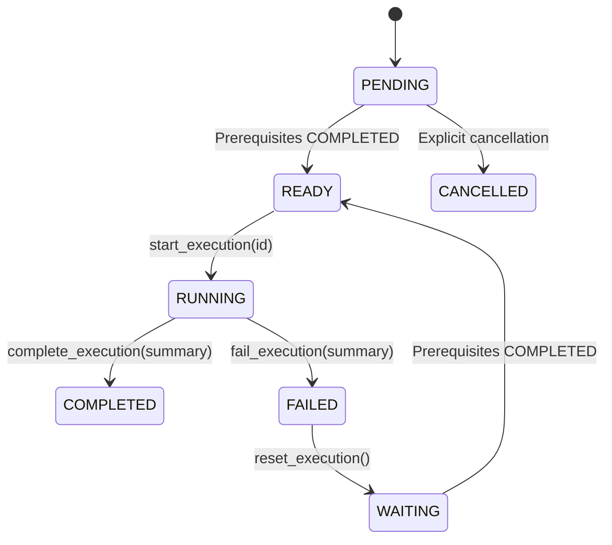

# Task & Execution Lifecycle Architecture

**Modules**: [task_graph.py](file:///c:/Users/user/AI-Orchestrator/task_graph.py), [execution_engine.py](file:///c:/Users/user/AI-Orchestrator/execution_engine.py)

---

## 1. Lifecycle Overview

Tasks in AI-Orchestrator move through deterministic states managed by `TaskNode` lifecycle mutation methods and `ExecutionEngine`.

---

## 2. Enums & States

### `TaskStatus` Enum
- `PENDING`: Task created; waiting for prerequisite dependencies.
- `READY`: All direct prerequisites have reached `COMPLETED`.
- `RUNNING`: Task is actively executing.
- `COMPLETED`: Execution succeeded; unlocks dependent downstream tasks.
- `FAILED`: Execution failed; keeps downstream tasks blocked.
- `CANCELLED`: Explicitly cancelled.

### `ExecutionState` Enum
- `WAITING`: Initial state.
- `READY`: Prerequisites met.
- `RUNNING`: Execution active.
- `COMPLETED`: Succeeded.
- `FAILED`: Failed.
- `PARTIAL`: Partially complete.
- `CANCELLED`: Cancelled.

---

## 3. State Transition Matrix

---

## 4. Lifecycle Mutation Operations

- `start_execution(execution_id)`: Transitions `status` and `execution_state` to `RUNNING`, sets `last_execution_id`, increments `attempt_count` by 1, and records `started_at` timestamp.
- `complete_execution(result_summary=None)`: Transitions `status` and `execution_state` to `COMPLETED`, records `result_summary`, sets `completed_at`.
- `fail_execution(result_summary=None)`: Transitions `status` and `execution_state` to `FAILED`, records error summary in `result_summary`, sets `completed_at`.
- `reset_execution()`: Resets `status` to `PENDING` and `execution_state` to `WAITING`, clearing timestamps and execution IDs to prepare for retries.
