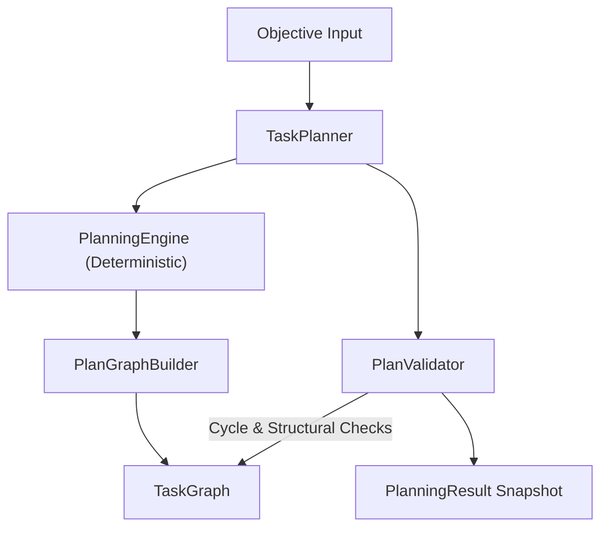

# Intelligent Planning Pipeline Architecture

**Module**: [planner.py](file:///c:/Users/user/AI-Orchestrator/planner.py)

---

## 1. Pipeline Overview

The planning pipeline decomposes user objectives into validated `TaskGraph` structures without invoking model execution engines or executing runtime actions.

---

## 2. Component Insulation

### `PlanGraphBuilder`
Insulates planning strategy logic from direct `TaskGraph` dictionary operations:
- `build_root_task(objective)`: Sets `plan_role = "ROOT_OBJECTIVE"`, `is_executable = False`.
- `build_level_node(...)`: Sets `plan_role = "LEVEL_GROUP"`, `level_name = "Phase"`, `is_executable = False`.
- `build_leaf_task(...)`: Sets `plan_role = "LEAF_TASK"`, `is_executable = True`.
- `connect_dependency(...)`: Adds `DEPENDS_ON` edges.

---

## 3. Mandatory 7-Step Validation Boundary (`PlanValidator`)

Before a plan is marked `VALIDATED`, `PlanValidator` executes:
1. **Cycle Detection**: Invokes `DependencyScheduler.detect_cycles()`.
2. **Registry Uniqueness**: Ensures Objective and Plan IDs are unique in workspace registries.
3. **Root Task Presence**: Confirms root task node exists in `TaskGraph`.
4. **Orphan Check**: Verifies non-root tasks have valid parent task IDs.
5. **Edge Target Verification**: Confirms all edge sources and targets exist.
6. **Hierarchy Depth Check**: Verifies depth <= `max_depth` (default 4) and checks for circular parentage.
7. **Leaf Executability Verification**: Warns if leaf nodes are marked non-executable.
