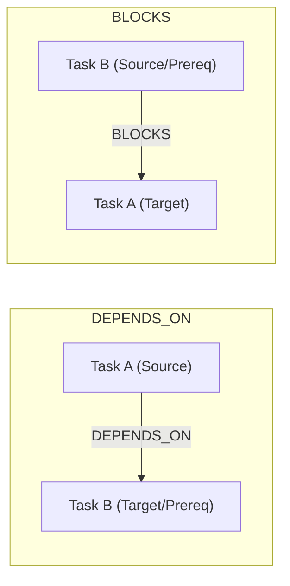

# TaskGraph & Task Node Architecture

**Module**: [task_graph.py](file:///c:/Users/user/AI-Orchestrator/task_graph.py)

---

## 1. Overview

`TaskGraph` represents tasks, subtask hierarchies, and dependency relationships as a directed graph owned by a `TaskWorkspace`.

---

## 2. Core Entities

### `TaskNode`
Represents an individual node in the graph:
- `task_id`: Unique string identifier.
- `workspace_id`: ID of the owning workspace.
- `parent_task_id`: Optional parent task ID for structural hierarchies.
- `title` & `description`: Task metadata.
- `status`: Instance of `TaskStatus` (`PENDING`, `READY`, `RUNNING`, `COMPLETED`, `FAILED`, `CANCELLED`).
- `priority`: Priority integer (higher values indicate higher execution priority).
- `attempt_count`: Execution attempt counter.
- `execution_state`: Instance of `ExecutionState` (`WAITING`, `READY`, `RUNNING`, `COMPLETED`, `FAILED`, `PARTIAL`, `CANCELLED`).
- `last_execution_id`: Optional ID of most recent execution binding.
- `result_summary`: Optional execution result summary snippet.

### `TaskEdge`
Represents a directed dependency edge:
- `source_task_id`: ID of dependent task.
- `target_task_id`: ID of prerequisite task.
- `dependency_type`: Instance of `DependencyType` (`DEPENDS_ON`, `BLOCKS`, `RELATED`).

---

## 3. Dependency Relationships

- **`DEPENDS_ON`**: `source_task_id` requires `target_task_id` to reach `COMPLETED` status before `source_task_id` can run.
- **`BLOCKS`**: `source_task_id` prevents `target_task_id` from running until `source_task_id` completes.
