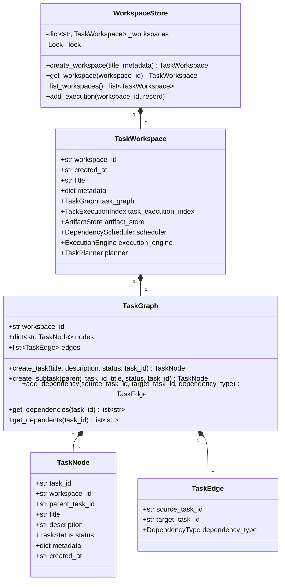

# Capability 1: Task Workspace & Task Graph

**Implementation Status**: COMPLETE & FROZEN  
**Modules**: `workspace.py`, `task_graph.py`

---

## 1. Purpose

Capability 1 establishes the foundational data ownership and graph structure for AI-Orchestrator. It provides an in-memory workspace container (`TaskWorkspace`), a thread-safe workspace registry (`WorkspaceStore`), and a directed task graph (`TaskGraph`) capable of representing tasks (`TaskNode`), subtasks, parent-child hierarchies, and directional dependencies (`TaskEdge`).

---

## 2. Architecture

---

## 3. Public APIs

### `TaskWorkspace` ([workspace.py](file:///c:/Users/user/AI-Orchestrator/workspace.py))
- `TaskWorkspace(workspace_id, created_at, title, metadata)`: Dataclass initialized via `__post_init__` to automatically construct child components.

### `WorkspaceStore` ([workspace.py](file:///c:/Users/user/AI-Orchestrator/workspace.py))
- `create_workspace(title=None, metadata=None) -> TaskWorkspace`
- `get_workspace(workspace_id: str) -> TaskWorkspace`
- `list_workspaces() -> list[TaskWorkspace]`

### `TaskGraph` ([task_graph.py](file:///c:/Users/user/AI-Orchestrator/task_graph.py))
- `create_task(title, description=None, metadata=None, status=TaskStatus.PENDING, task_id=None) -> TaskNode`
- `create_subtask(parent_task_id, title, description=None, metadata=None, status=TaskStatus.PENDING, task_id=None) -> TaskNode`
- `add_dependency(source_task_id, target_task_id, dependency_type=DependencyType.DEPENDS_ON) -> TaskEdge`
- `get_task(task_id) -> TaskNode`
- `get_children(task_id) -> list[TaskNode]`
- `get_parents(task_id) -> list[TaskNode]`
- `get_dependencies(task_id) -> list[str]`
- `get_dependents(task_id) -> list[str]`

---

## 4. Design Decisions

1. **In-Memory Core**: Tasks and workspaces are maintained in process memory for zero-latency lookups and deterministic performance.
2. **Explicit Parent-Child vs. Graph Edges**: Parent-child relationships (`parent_task_id`) represent structural breakdown, whereas `TaskEdge` elements represent execution prerequisites (`DEPENDS_ON`, `BLOCKS`, `RELATED`).
3. **Immutability of Workspace IDs**: Once assigned, workspace IDs and task IDs are immutable strings (UUID v4 by default).

---

## 5. Interaction with Other Capabilities

- **Capability 2**: `TaskExecutionIndex` attaches execution bindings to `TaskNode` objects created in Capability 1.
- **Capability 3**: `ExecutionEngine` mutates `TaskStatus` on `TaskNode` instances as executions start and complete.
- **Capability 4**: `DependencyScheduler` inspects `TaskGraph` nodes and edges to compute readiness and detect cycles.
- **Capability 5**: `TaskPlanner` uses `PlanGraphBuilder` to build structured `TaskNode` trees in `TaskGraph`.

---

## 6. Future Extension Points (Not Implemented)

- Disk-backed persistent storage drivers for `WorkspaceStore`.
- Multi-workspace task edges for inter-workspace collaboration.
