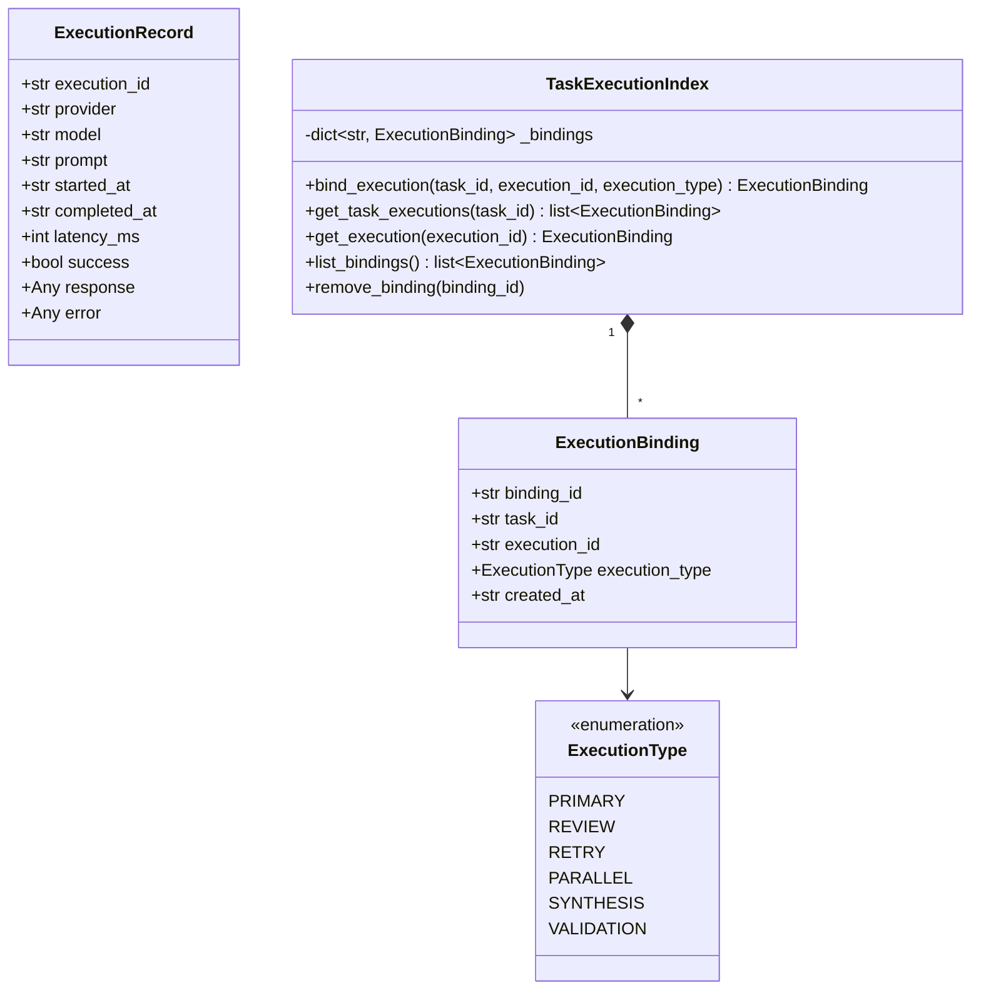

# Capability 2: Execution Records & Execution Bindings

**Implementation Status**: COMPLETE & FROZEN  
**Modules**: `workspace.py`, `execution_binding.py`

---

## 1. Purpose

Capability 2 introduces immutable tracking of execution logs (`ExecutionRecord`), formal bindings between tasks and executions (`ExecutionBinding`), and an in-memory index (`TaskExecutionIndex`). This allows Antigravity to audit model calls, measure latency, track provider responses, and correlate task lifecycle states with execution outputs.

---

## 2. Architecture

---

## 3. Public APIs

### `ExecutionRecord` ([workspace.py](file:///c:/Users/user/AI-Orchestrator/workspace.py))
- `ExecutionRecord(execution_id, provider, model, prompt, started_at, completed_at, latency_ms, success, response, error)`

### `ExecutionBinding` ([execution_binding.py](file:///c:/Users/user/AI-Orchestrator/execution_binding.py))
- `ExecutionBinding(binding_id, task_id, execution_id, execution_type, created_at)`
- `to_dict() -> dict`

### `TaskExecutionIndex` ([execution_binding.py](file:///c:/Users/user/AI-Orchestrator/execution_binding.py))
- `bind_execution(task_id: str, execution_id: str, execution_type=ExecutionType.PRIMARY) -> ExecutionBinding`
- `get_task_executions(task_id: str) -> list[ExecutionBinding]`
- `get_execution(execution_id: str) -> ExecutionBinding | None`
- `list_bindings() -> list[ExecutionBinding]`
- `remove_binding(binding_id: str) -> None`

---

## 4. Design Decisions

1. **Decoupled Execution & Task Identifiers**: `ExecutionRecord` exists independently in `workspace.executions`, allowing provider calls without task bindings when necessary.
2. **Explicit Binding Types**: `ExecutionType` categorizes executions into `PRIMARY`, `REVIEW`, `RETRY`, `PARALLEL`, `SYNTHESIS`, or `VALIDATION`, enabling rich execution auditing.
3. **Many-to-One Binding**: Multiple executions (e.g. initial attempt, review call, retry attempt) can be bound to the same `task_id`.

---

## 5. Interaction with Other Capabilities

- **Capability 1**: `TaskExecutionIndex` references `task_id` values managed in `TaskGraph`.
- **Capability 3**: `ExecutionEngine` automatically constructs `ExecutionRecord` instances and calls `bind_execution` upon completing task executions.
- **Capability 4 & 5**: Schedulers and planners maintain visibility over execution histories via workspace dictionaries.

---

## 6. Future Extension Points (Not Implemented)

- Database persistence layer for execution logs.
- Execution payload diffing across successive retry bindings.
