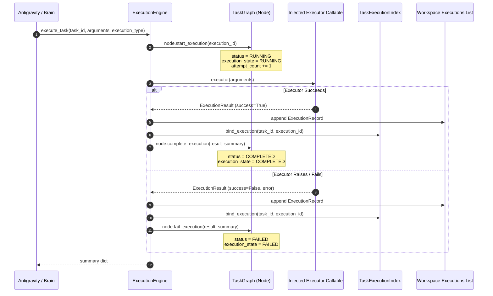

# Capability 3: Execution Engine & Lifecycle

**Implementation Status**: COMPLETE & FROZEN  
**Modules**: `execution_engine.py`, `execution_result.py`, `artifact_store.py`, `task_graph.py`

---

## 1. Purpose

Capability 3 implements autonomous task execution coordination and artifact management. The `ExecutionEngine` manages single and batch task execution, drives `TaskNode` lifecycle transitions (`RUNNING` → `COMPLETED` / `FAILED`), increments attempt counts, constructs execution records, binds executions, and stores produced artifacts in `ArtifactStore`.

---

## 2. Architecture

---

## 3. Public APIs

### `ExecutionEngine` ([execution_engine.py](file:///c:/Users/user/AI-Orchestrator/execution_engine.py))
- `execute_task(task_id: str, arguments: dict, execution_type=ExecutionType.PRIMARY) -> dict`
- `execute_tasks(task_ids: list[str], arguments_list: list[dict], execution_type=ExecutionType.PRIMARY, parallel=False) -> dict`

### `ArtifactStore` & `Artifact` ([artifact_store.py](file:///c:/Users/user/AI-Orchestrator/artifact_store.py))
- `create_artifact(artifact: Artifact) -> Artifact`
- `get_artifact(artifact_id: str) -> Artifact`
- `list_artifacts() -> list[Artifact]`
- `list_task_artifacts(task_id: str) -> list[Artifact]`
- `list_execution_artifacts(execution_id: str) -> list[Artifact]`
- `delete_artifact(artifact_id: str) -> None`

---

## 4. Design Decisions

1. **Injected Executor Callable**: `ExecutionEngine` takes a callable `(dict) -> ExecutionResult` at initialization, preventing tight coupling to specific provider APIs.
2. **Explicit Artifact Creation**: Artifacts are never inferred or automatically parsed from model responses; only explicit client requests populate `ArtifactStore`.
3. **Robust Exception Catching**: If the executor callable raises an unhandled exception, `ExecutionEngine` catches it, records latency, constructs a failed `ExecutionResult`, updates `TaskNode` status to `FAILED`, and records the execution log without crashing the application.

---

## 5. Interaction with Other Capabilities

- **Capability 1**: `ExecutionEngine` mutates lifecycle states (`start_execution`, `complete_execution`, `fail_execution`) on `TaskNode` instances in `TaskGraph`.
- **Capability 2**: Automatically creates `ExecutionRecord` instances and updates `TaskExecutionIndex`.
- **Capability 4**: Updates `TaskStatus.COMPLETED` on nodes, enabling `DependencyScheduler` to unblock downstream dependent tasks.

---

## 6. Future Extension Points (Not Implemented)

- Automatic artifact extraction from structured provider outputs.
- Subprocess/sandbox environment isolation for executable artifacts.
