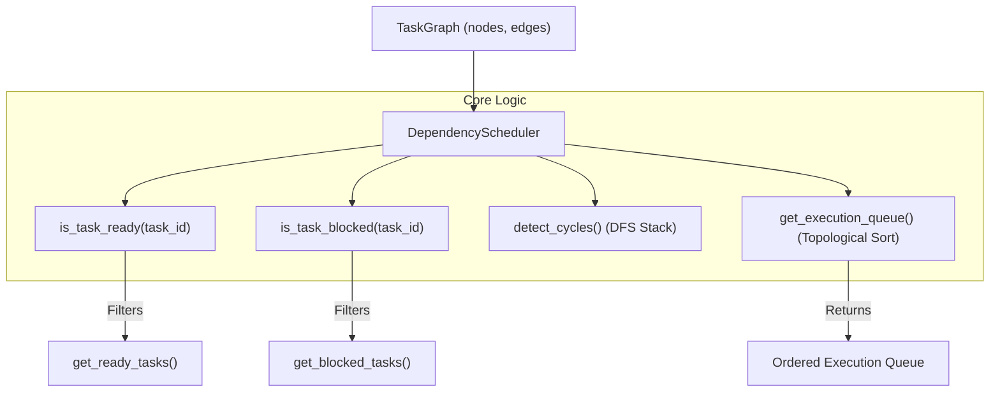

# Capability 4: Dependency Scheduler

**Implementation Status**: COMPLETE & FROZEN  
**Modules**: `scheduler.py`, `task_graph.py`

---

## 1. Purpose

Capability 4 provides a deterministic, dependency-aware task scheduler (`DependencyScheduler`). The scheduler evaluates `TaskGraph` state to determine task readiness, identify blocked tasks, detect directed dependency cycles using Depth-First Search (DFS), and generate topologically ordered execution queues.

---

## 2. Architecture

---

## 3. Public APIs

### `DependencyScheduler` ([scheduler.py](file:///c:/Users/user/AI-Orchestrator/scheduler.py))
- `is_task_ready(task_id: str) -> bool`: Returns `True` if task is `PENDING`/`READY` and **all direct prerequisites are `COMPLETED`**.
- `is_task_blocked(task_id: str) -> bool`: Returns `True` if task is blocked by uncompleted dependencies or cycle membership.
- `can_execute(task_id: str) -> bool`: Alias for `is_task_ready(task_id)`.
- `get_ready_tasks() -> list[TaskNode]`: Returns executable tasks sorted by priority (descending), creation timestamp (ascending), and task ID.
- `get_blocked_tasks() -> list[TaskNode]`: Returns blocked tasks.
- `get_completed_tasks() -> list[TaskNode]`: Returns completed tasks.
- `get_failed_tasks() -> list[TaskNode]`: Returns failed tasks.
- `get_execution_queue() -> list[TaskNode]`: Returns ordered topological execution queue.
- `detect_cycles() -> list[list[str]]`: Returns list of detected cycles (e.g. `[["t1", "t2", "t1"]]`).
- `get_scheduler_state() -> dict`: Returns full state summary.

---

## 4. Design Decisions

1. **Zero Execution Responsibilities**: `DependencyScheduler` purely evaluates eligibility; it never launches tasks or calls model APIs.
2. **Deterministic Candidate Sorting**: When multiple tasks are ready, `get_ready_tasks()` sorts them by `(-priority, created_at, task_id)` to ensure repeatable execution order across environments.
3. **Strict Gatekeeping**: `AntigravityBrain` validates every execution request against `DependencyScheduler` prior to executing tasks, raising a `ValueError` if a task is blocked or unready.

---

## 5. Interaction with Other Capabilities

- **Capability 1**: Reads `TaskNode` statuses and `TaskEdge` dependencies from `TaskGraph`.
- **Capability 3**: Execution of tasks updates `TaskNode.status` to `COMPLETED`, automatically causing subsequent `is_task_ready` calls on downstream tasks to return `True`.
- **Capability 5**: Validates generated plans during `PlanValidator.validate(...)` using `detect_cycles()`.

---

## 6. Future Extension Points (Not Implemented)

- Resource-constrained scheduling (limiting concurrency based on CPU/RAM/token limits).
- Dynamic priority inheritance algorithms for deep dependency paths.
