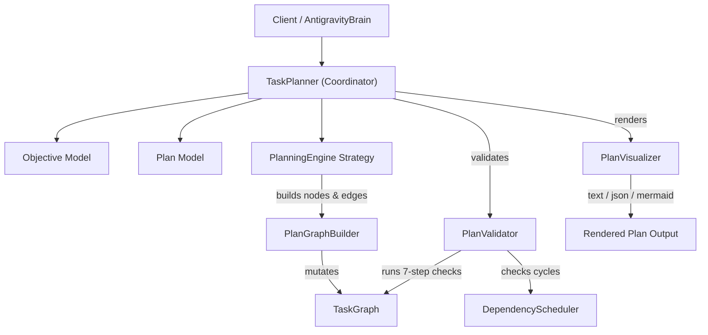

# Capability 5: Intelligent Task Planner

**Implementation Status**: COMPLETE & FROZEN  
**Modules**: `planner.py`, `planner_models.py`, `task_graph.py`, `scheduler.py`

---

## 1. Purpose

Capability 5 provides high-level objective model abstractions, multi-level goal decomposition, structural graph validation, visualization, dynamic task expansion, and conservative plan regeneration.

---

## 2. Architecture

---

## 3. Public APIs

### `TaskPlanner` ([planner.py](file:///c:/Users/user/AI-Orchestrator/planner.py))
- `create_objective(title, description=None, constraints=None, success_criteria=None, priority=100, metadata=None, objective_id=None) -> Objective`
- `create_plan(objective_input, levels_spec=None, options=None) -> PlanningResult`
- `expand_task(task_id, subtasks_spec, plan_id=None) -> PlanningResult`
- `regenerate_plan(plan_id, target_task_id=None, objective_input=None, levels_spec=None, options=None) -> PlanningResult`
- `get_plan(plan_id=None) -> PlanningResult`
- `visualize_plan(plan_id=None, format="text") -> str`

### Models ([planner_models.py](file:///c:/Users/user/AI-Orchestrator/planner_models.py))
- `Objective`, `Plan`, `PlanningLevelSpec`, `TaskSpecification`, `PlanningResult` (frozen), `PlanStatus`, `LevelType`.

---

## 4. Design Decisions

1. **Planning NEVER Executes**: `TaskPlanner` creates and populates task graphs in `TaskStatus.PENDING` status. It does not invoke execution models or provider APIs.
2. **Graph Builder Insulation**: `PlanGraphBuilder` encapsulates `TaskGraph` mutations, setting required metadata (`plan_role`, `is_executable`, `level_name`).
3. **Single-Authority Validation Boundary**: `PlanValidator` performs a mandatory 7-step pre-scheduling check:
   - Cycle detection
   - Registry ID uniqueness
   - Root task presence
   - Orphan/disconnected node check
   - Edge target verification
   - Hierarchy depth & circular parentage check
   - Leaf node executability verification
4. **Conservative Plan Regeneration**: `regenerate_plan` removes only `PENDING` unexecuted tasks, leaving `COMPLETED`, `FAILED`, and `RUNNING` nodes completely untouched.

---

## 5. Interaction with Other Capabilities

- **Capability 1**: Populates `TaskWorkspace.objectives`, `TaskWorkspace.plans`, and builds `TaskNode`/`TaskEdge` entities in `TaskGraph`.
- **Capability 4**: Delegates cycle detection to `DependencyScheduler.detect_cycles()` during validation.
- **Capability 3**: Marks container nodes as `is_executable = False` when expanded, ensuring only leaf tasks are executed by `ExecutionEngine`.

---

## 6. Future Extension Points (Not Implemented)

- LLM-based strategy implementations for `PlanningEngine` (decomposing goals using live model prompts).
- Dynamic plan optimization during active execution based on runtime latency telemetry.
