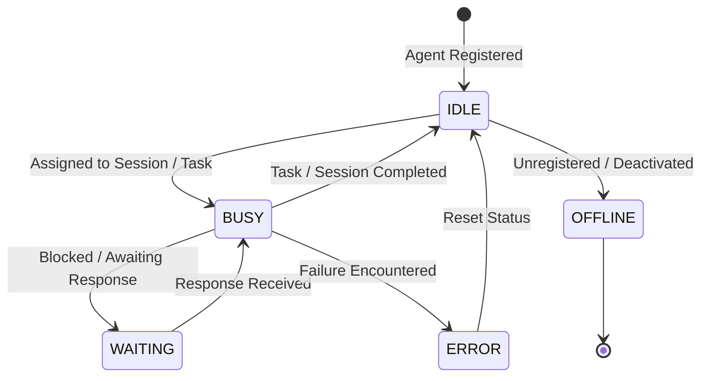

# Agent Lifecycle Diagram

```mermaid
stateDiagram-v2
    [*] --> IDLE : Agent Registered
    IDLE --> BUSY : Assigned to Session / Task
    BUSY --> WAITING : Blocked / Awaiting Response
    WAITING --> BUSY : Response Received
    BUSY --> IDLE : Task / Session Completed
    IDLE --> OFFLINE : Unregistered / Deactivated
    BUSY --> ERROR : Failure Encountered
    ERROR --> IDLE : Reset Status
    OFFLINE --> [*]
```
