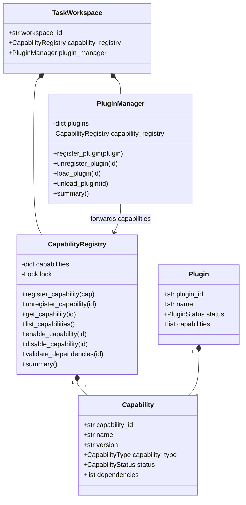

# Diagram: CapabilityRegistry & TaskWorkspace Structure

```mermaid
classDiagram
    class TaskWorkspace {
        +str workspace_id
        +CapabilityRegistry capability_registry
        +PluginManager plugin_manager
    }

    class CapabilityRegistry {
        -dict capabilities
        -Lock lock
        +register_capability(cap)
        +unregister_capability(id)
        +get_capability(id)
        +list_capabilities()
        +enable_capability(id)
        +disable_capability(id)
        +validate_dependencies(id)
        +summary()
    }

    class PluginManager {
        -dict plugins
        -CapabilityRegistry capability_registry
        +register_plugin(plugin)
        +unregister_plugin(id)
        +load_plugin(id)
        +unload_plugin(id)
        +summary()
    }

    class Capability {
        +str capability_id
        +str name
        +str version
        +CapabilityType capability_type
        +CapabilityStatus status
        +list dependencies
    }

    class Plugin {
        +str plugin_id
        +str name
        +PluginStatus status
        +list capabilities
    }

    TaskWorkspace *-- CapabilityRegistry
    TaskWorkspace *-- PluginManager
    PluginManager --> CapabilityRegistry : forwards capabilities
    CapabilityRegistry "1" *-- "*" Capability
    Plugin "1" *-- "*" Capability
```
