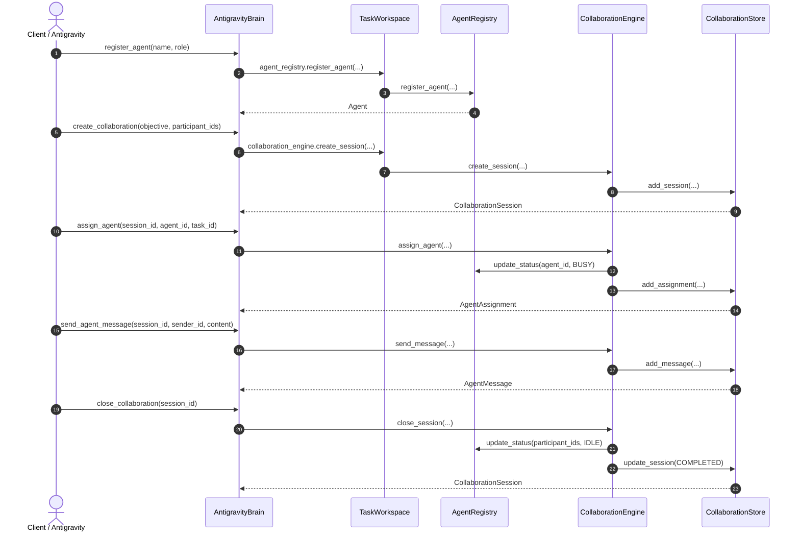

# Collaboration Sequence Diagram

```mermaid
sequenceDiagram
    autonumber
    actor Caller as Client / Antigravity
    participant Brain as AntigravityBrain
    participant WS as TaskWorkspace
    participant Reg as AgentRegistry
    participant Engine as CollaborationEngine
    participant Store as CollaborationStore

    Caller->>Brain: register_agent(name, role)
    Brain->>WS: agent_registry.register_agent(...)
    WS->>Reg: register_agent(...)
    Reg-->>Brain: Agent

    Caller->>Brain: create_collaboration(objective, participant_ids)
    Brain->>WS: collaboration_engine.create_session(...)
    WS->>Engine: create_session(...)
    Engine->>Store: add_session(...)
    Store-->>Brain: CollaborationSession

    Caller->>Brain: assign_agent(session_id, agent_id, task_id)
    Brain->>Engine: assign_agent(...)
    Engine->>Reg: update_status(agent_id, BUSY)
    Engine->>Store: add_assignment(...)
    Store-->>Brain: AgentAssignment

    Caller->>Brain: send_agent_message(session_id, sender_id, content)
    Brain->>Engine: send_message(...)
    Engine->>Store: add_message(...)
    Store-->>Brain: AgentMessage

    Caller->>Brain: close_collaboration(session_id)
    Brain->>Engine: close_session(...)
    Engine->>Reg: update_status(participant_ids, IDLE)
    Engine->>Store: update_session(COMPLETED)
    Store-->>Brain: CollaborationSession
```
