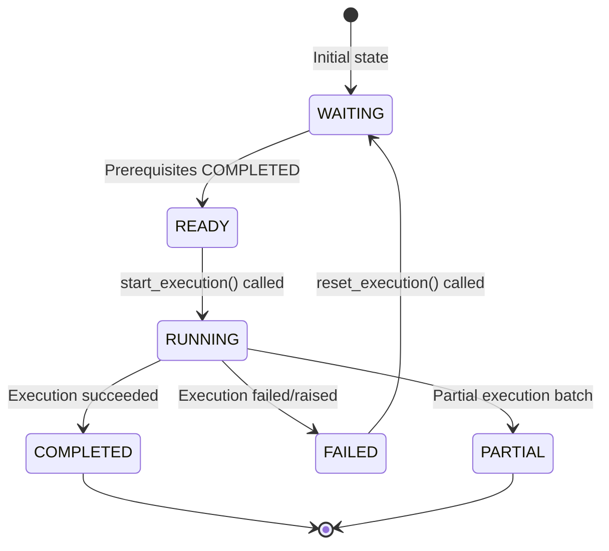

# Execution State Lifecycle Diagram

```mermaid
stateDiagram-v2
    [*] --> WAITING: Initial state
    WAITING --> READY: Prerequisites COMPLETED
    READY --> RUNNING: start_execution() called
    RUNNING --> COMPLETED: Execution succeeded
    RUNNING --> FAILED: Execution failed/raised
    RUNNING --> PARTIAL: Partial execution batch
    FAILED --> WAITING: reset_execution() called
    COMPLETED --> [*]
    PARTIAL --> [*]
```
