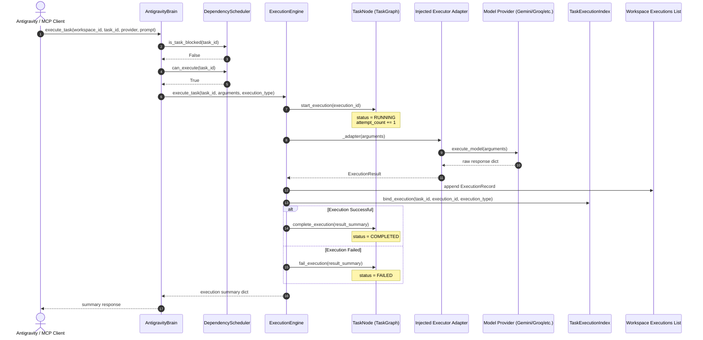

# Execution Sequence Diagram

```mermaid
sequenceDiagram
    autonumber
    actor Client as Antigravity / MCP Client
    participant B as AntigravityBrain
    participant DS as DependencyScheduler
    participant EE as ExecutionEngine
    participant TN as TaskNode (TaskGraph)
    participant EX as Injected Executor Adapter
    participant PR as Model Provider (Gemini/Groq/etc.)
    participant TEI as TaskExecutionIndex
    participant ES as Workspace Executions List

    Client->>B: execute_task(workspace_id, task_id, provider, prompt)
    B->>DS: is_task_blocked(task_id)
    DS-->>B: False
    B->>DS: can_execute(task_id)
    DS-->>B: True
    B->>EE: execute_task(task_id, arguments, execution_type)
    EE->>TN: start_execution(execution_id)
    Note over TN: status = RUNNING<br/>attempt_count += 1
    EE->>EX: _adapter(arguments)
    EX->>PR: execute_model(arguments)
    PR-->>EX: raw response dict
    EX-->>EE: ExecutionResult
    EE->>ES: append ExecutionRecord
    EE->>TEI: bind_execution(task_id, execution_id, execution_type)
    alt Execution Successful
        EE->>TN: complete_execution(result_summary)
        Note over TN: status = COMPLETED
    else Execution Failed
        EE->>TN: fail_execution(result_summary)
        Note over TN: status = FAILED
    end
    EE-->>B: execution summary dict
    B-->>Client: summary response
```
