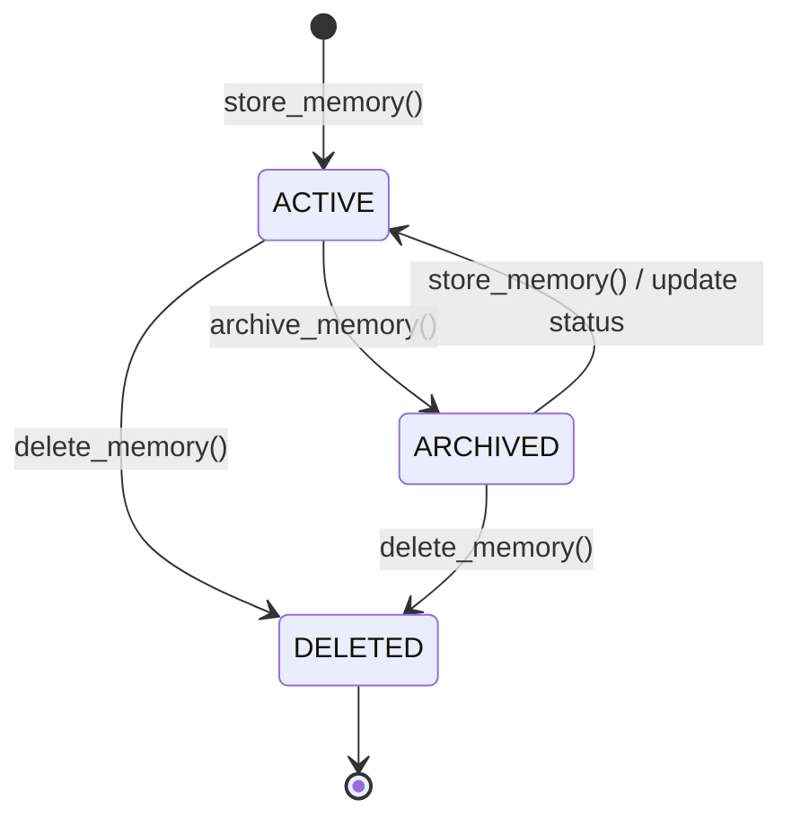

# Memory Record Lifecycle Diagram

## Lifecycle States Explanation

- **`ACTIVE`**: The initial state when a record is stored via `store_memory()`. Appears in all queries and summaries by default.
- **`ARCHIVED`**: Soft-archived state via `archive_memory()`. Retained for historical record, but separable from active focus when filtering.
- **`DELETED`**: Soft-deleted state via `delete_memory()`. Hidden from standard listings and deterministic search unless explicitly requested.
