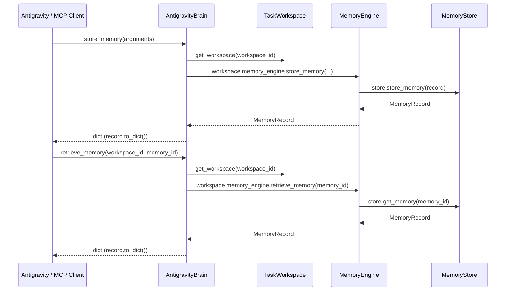
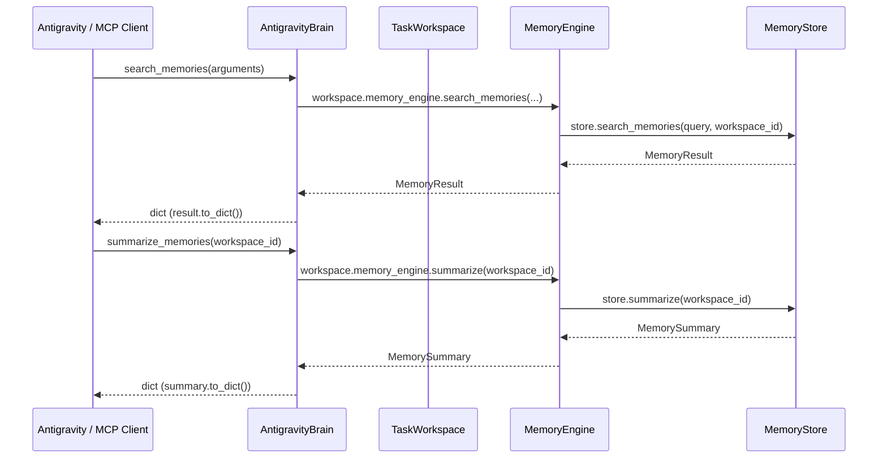

# Memory Subsystem Sequence Diagrams

## Store and Retrieve Sequence

```mermaid
sequenceDiagram
    participant Client as Antigravity / MCP Client
    participant Brain as AntigravityBrain
    participant Workspace as TaskWorkspace
    participant Engine as MemoryEngine
    participant Store as MemoryStore

    Client->>Brain: store_memory(arguments)
    Brain->>Workspace: get_workspace(workspace_id)
    Brain->>Engine: workspace.memory_engine.store_memory(...)
    Engine->>Store: store.store_memory(record)
    Store-->>Engine: MemoryRecord
    Engine-->>Brain: MemoryRecord
    Brain-->>Client: dict (record.to_dict())

    Client->>Brain: retrieve_memory(workspace_id, memory_id)
    Brain->>Workspace: get_workspace(workspace_id)
    Brain->>Engine: workspace.memory_engine.retrieve_memory(memory_id)
    Engine->>Store: store.get_memory(memory_id)
    Store-->>Engine: MemoryRecord
    Engine-->>Brain: MemoryRecord
    Brain-->>Client: dict (record.to_dict())
```

## Search and Summarize Sequence

```mermaid
sequenceDiagram
    participant Client as Antigravity / MCP Client
    participant Brain as AntigravityBrain
    participant Workspace as TaskWorkspace
    participant Engine as MemoryEngine
    participant Store as MemoryStore

    Client->>Brain: search_memories(arguments)
    Brain->>Engine: workspace.memory_engine.search_memories(...)
    Engine->>Store: store.search_memories(query, workspace_id)
    Store-->>Engine: MemoryResult
    Engine-->>Brain: MemoryResult
    Brain-->>Client: dict (result.to_dict())

    Client->>Brain: summarize_memories(workspace_id)
    Brain->>Engine: workspace.memory_engine.summarize(workspace_id)
    Engine->>Store: store.summarize(workspace_id)
    Store-->>Engine: MemorySummary
    Engine-->>Brain: MemorySummary
    Brain-->>Client: dict (summary.to_dict())
```
