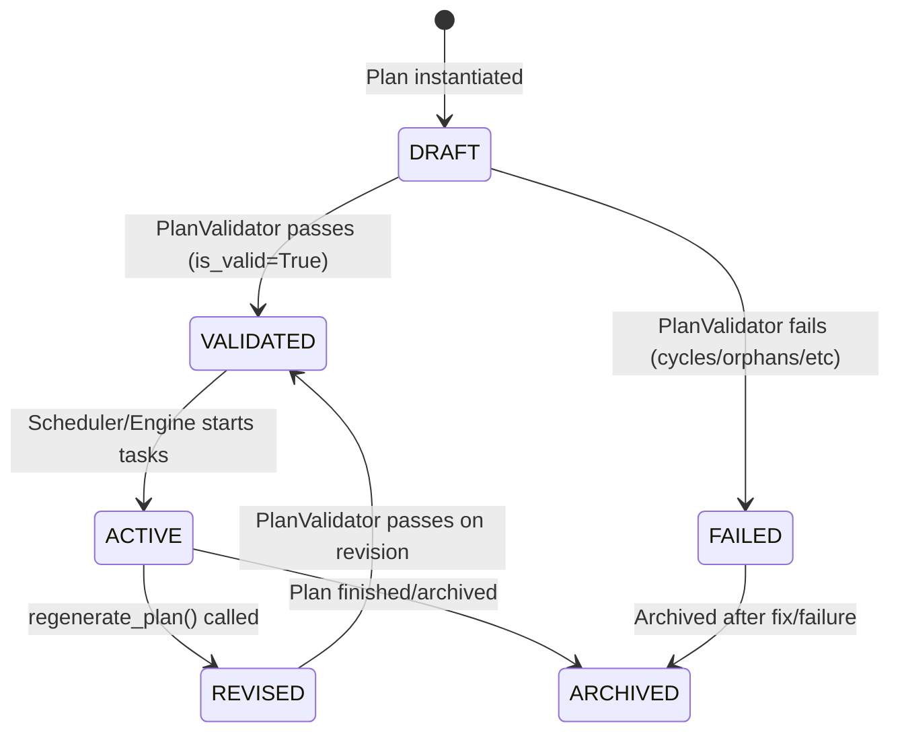

# Planning Lifecycle State Diagram

```mermaid
stateDiagram-v2
    [*] --> DRAFT: Plan instantiated
    DRAFT --> VALIDATED: PlanValidator passes (is_valid=True)
    DRAFT --> FAILED: PlanValidator fails (cycles/orphans/etc)
    VALIDATED --> ACTIVE: Scheduler/Engine starts tasks
    ACTIVE --> REVISED: regenerate_plan() called
    REVISED --> VALIDATED: PlanValidator passes on revision
    ACTIVE --> ARCHIVED: Plan finished/archived
    FAILED --> ARCHIVED: Archived after fix/failure
```
