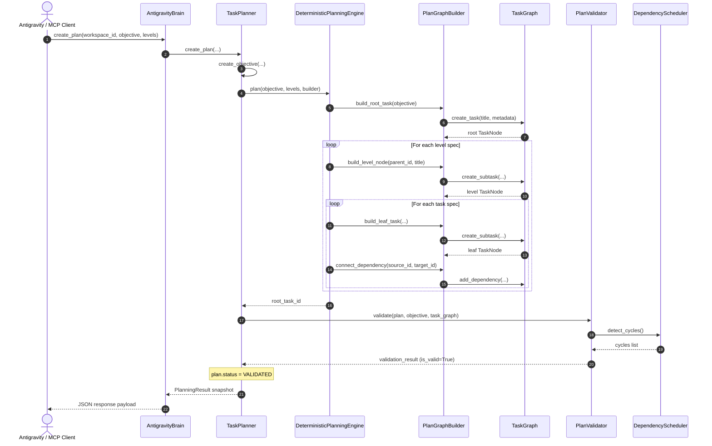

# Planning Sequence Diagram

```mermaid
sequenceDiagram
    autonumber
    actor Client as Antigravity / MCP Client
    participant B as AntigravityBrain
    participant TP as TaskPlanner
    participant PE as DeterministicPlanningEngine
    participant GB as PlanGraphBuilder
    participant TG as TaskGraph
    participant PV as PlanValidator
    participant DS as DependencyScheduler

    Client->>B: create_plan(workspace_id, objective, levels)
    B->>TP: create_plan(...)
    TP->>TP: create_objective(...)
    TP->>PE: plan(objective, levels, builder)
    PE->>GB: build_root_task(objective)
    GB->>TG: create_task(title, metadata)
    TG-->>GB: root TaskNode
    loop For each level spec
        PE->>GB: build_level_node(parent_id, title)
        GB->>TG: create_subtask(...)
        TG-->>GB: level TaskNode
        loop For each task spec
            PE->>GB: build_leaf_task(...)
            GB->>TG: create_subtask(...)
            TG-->>GB: leaf TaskNode
            PE->>GB: connect_dependency(source_id, target_id)
            GB->>TG: add_dependency(...)
        end
    end
    PE-->>TP: root_task_id
    TP->>PV: validate(plan, objective, task_graph)
    PV->>DS: detect_cycles()
    DS-->>PV: cycles list
    PV-->>TP: validation_result (is_valid=True)
    Note over TP: plan.status = VALIDATED
    TP-->>B: PlanningResult snapshot
    B-->>Client: JSON response payload
```
