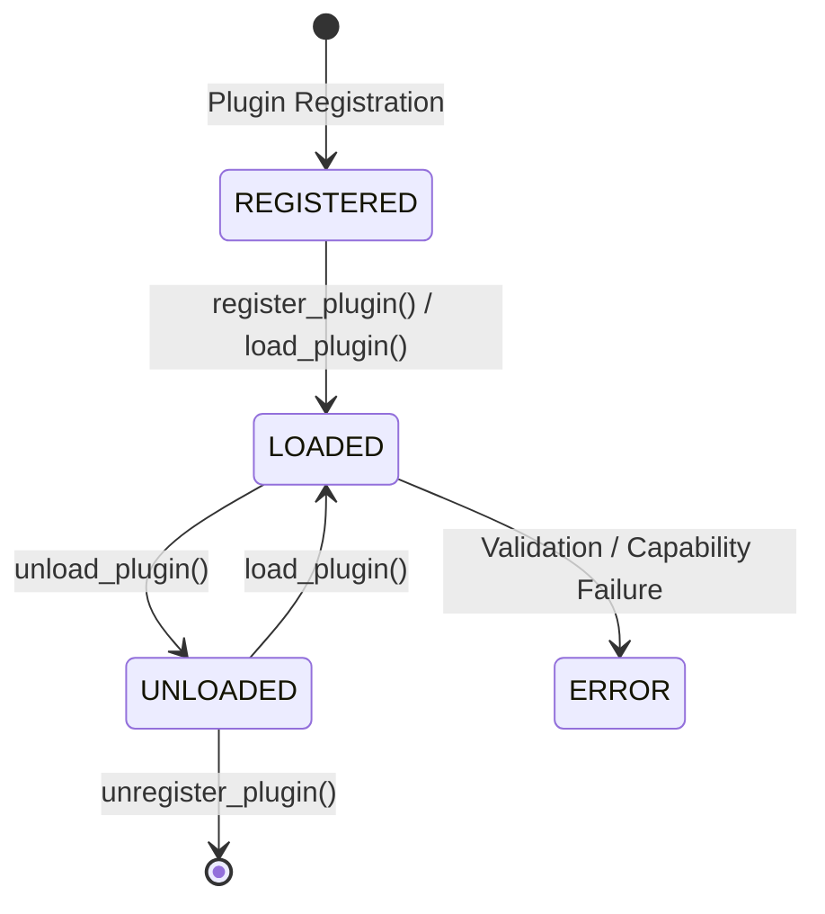

# Diagram: Plugin Lifecycle State Machine

```mermaid
stateDiagram-v2
    [*] --> REGISTERED : Plugin Registration
    REGISTERED --> LOADED : register_plugin() / load_plugin()
    LOADED --> UNLOADED : unload_plugin()
    UNLOADED --> LOADED : load_plugin()
    LOADED --> ERROR : Validation / Capability Failure
    UNLOADED --> [*] : unregister_plugin()
```
