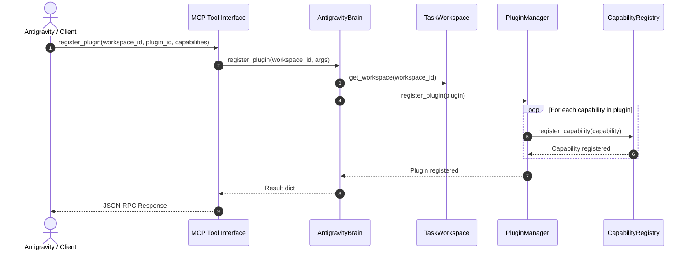

# Diagram: Plugin Registration Sequence

```mermaid
sequenceDiagram
    autonumber
    actor Caller as Antigravity / Client
    participant MCP as MCP Tool Interface
    participant Brain as AntigravityBrain
    participant WS as TaskWorkspace
    participant PM as PluginManager
    participant CR as CapabilityRegistry

    Caller->>MCP: register_plugin(workspace_id, plugin_id, capabilities)
    MCP->>Brain: register_plugin(workspace_id, args)
    Brain->>WS: get_workspace(workspace_id)
    Brain->>PM: register_plugin(plugin)
    loop For each capability in plugin
        PM->>CR: register_capability(capability)
        CR-->>PM: Capability registered
    end
    PM-->>Brain: Plugin registered
    Brain-->>MCP: Result dict
    MCP-->>Caller: JSON-RPC Response
```
