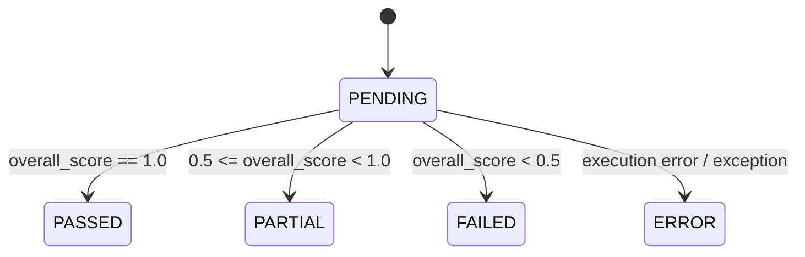

# Review Lifecycle Diagram

```mermaid
stateDiagram-v2
    [*] --> PENDING
    PENDING --> PASSED: overall_score == 1.0
    PENDING --> PARTIAL: 0.5 <= overall_score < 1.0
    PENDING --> FAILED: overall_score < 0.5
    PENDING --> ERROR: execution error / exception
```
