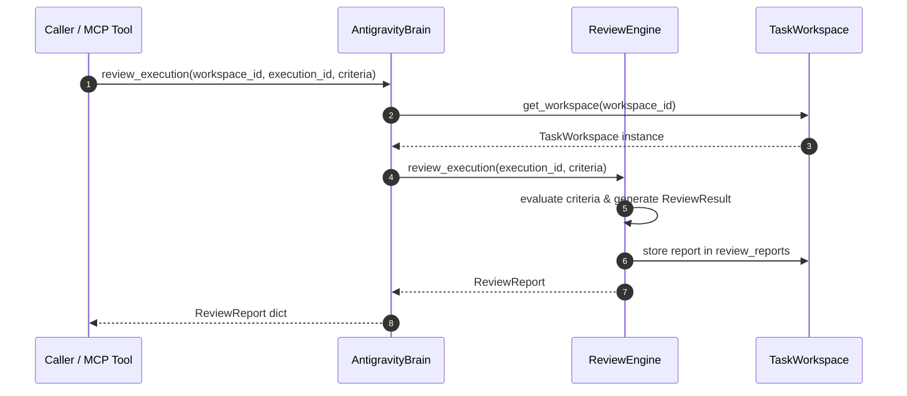

# Review Sequence Diagram

```mermaid
sequenceDiagram
    autonumber
    participant Caller as Caller / MCP Tool
    participant Brain as AntigravityBrain
    participant Engine as ReviewEngine
    participant Store as TaskWorkspace

    Caller->>Brain: review_execution(workspace_id, execution_id, criteria)
    Brain->>Store: get_workspace(workspace_id)
    Store-->>Brain: TaskWorkspace instance
    Brain->>Engine: review_execution(execution_id, criteria)
    Engine->>Engine: evaluate criteria & generate ReviewResult
    Engine->>Store: store report in review_reports
    Engine-->>Brain: ReviewReport
    Brain-->>Caller: ReviewReport dict
```
