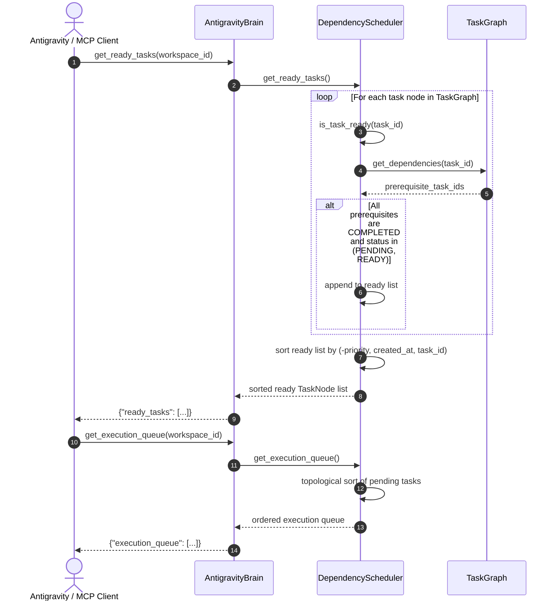

# Scheduling Sequence Diagram

```mermaid
sequenceDiagram
    autonumber
    actor Client as Antigravity / MCP Client
    participant B as AntigravityBrain
    participant DS as DependencyScheduler
    participant TG as TaskGraph

    Client->>B: get_ready_tasks(workspace_id)
    B->>DS: get_ready_tasks()
    loop For each task node in TaskGraph
        DS->>DS: is_task_ready(task_id)
        DS->>TG: get_dependencies(task_id)
        TG-->>DS: prerequisite_task_ids
        alt All prerequisites are COMPLETED and status in (PENDING, READY)
            DS->>DS: append to ready list
        end
    end
    DS->>DS: sort ready list by (-priority, created_at, task_id)
    DS-->>B: sorted ready TaskNode list
    B-->>Client: {"ready_tasks": [...]}

    Client->>B: get_execution_queue(workspace_id)
    B->>DS: get_execution_queue()
    DS->>DS: topological sort of pending tasks
    DS-->>B: ordered execution queue
    B-->>Client: {"execution_queue": [...]}
```
