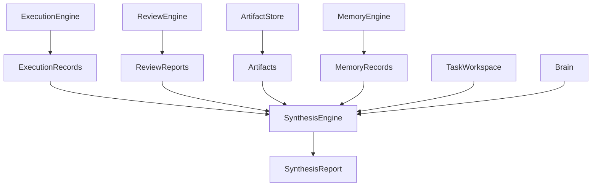

# Synthesis Lifecycle Diagram

```mermaid
graph TD
    ExecutionEngine --> ExecutionRecords
    ReviewEngine --> ReviewReports
    ArtifactStore --> Artifacts
    MemoryEngine --> MemoryRecords

    ExecutionRecords --> SynthesisEngine
    ReviewReports --> SynthesisEngine
    Artifacts --> SynthesisEngine
    MemoryRecords --> SynthesisEngine

    SynthesisEngine --> SynthesisReport
    TaskWorkspace --> SynthesisEngine
    Brain --> SynthesisEngine
```
