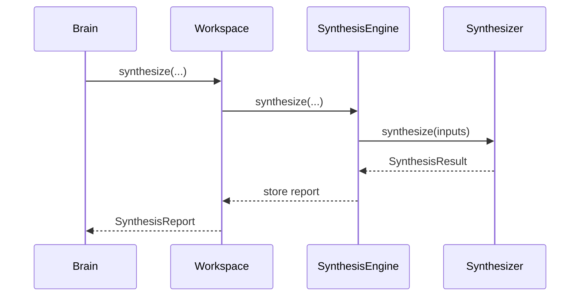

# Synthesis Sequence Diagram

```mermaid
sequenceDiagram

participant Brain
participant Workspace
participant SynthesisEngine
participant Synthesizer

Brain->>Workspace: synthesize(...)
Workspace->>SynthesisEngine: synthesize(...)

SynthesisEngine->>Synthesizer: synthesize(inputs)

Synthesizer-->>SynthesisEngine: SynthesisResult

SynthesisEngine-->>Workspace: store report

Workspace-->>Brain: SynthesisReport
```
