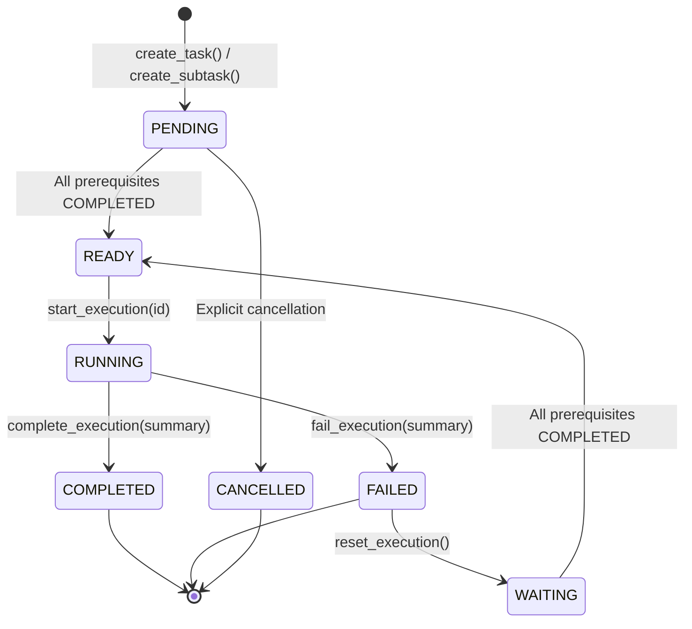

# Task Lifecycle State Diagram

```mermaid
stateDiagram-v2
    [*] --> PENDING: create_task() / create_subtask()
    PENDING --> READY: All prerequisites COMPLETED
    PENDING --> CANCELLED: Explicit cancellation
    READY --> RUNNING: start_execution(id)
    RUNNING --> COMPLETED: complete_execution(summary)
    RUNNING --> FAILED: fail_execution(summary)
    FAILED --> WAITING: reset_execution()
    WAITING --> READY: All prerequisites COMPLETED
    COMPLETED --> [*]
    FAILED --> [*]
    CANCELLED --> [*]
```
