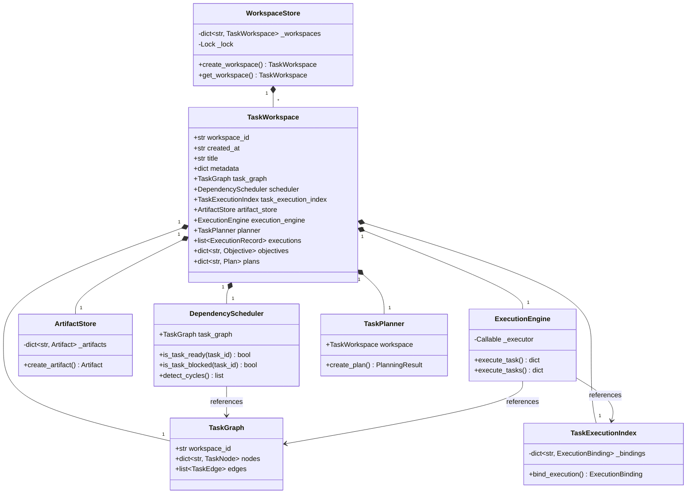

# Workspace Class & Ownership Diagram

```mermaid
classDiagram
    class WorkspaceStore {
        -dict~str, TaskWorkspace~ _workspaces
        -Lock _lock
        +create_workspace() TaskWorkspace
        +get_workspace() TaskWorkspace
    }

    class TaskWorkspace {
        +str workspace_id
        +str created_at
        +str title
        +dict metadata
        +TaskGraph task_graph
        +DependencyScheduler scheduler
        +TaskExecutionIndex task_execution_index
        +ArtifactStore artifact_store
        +ExecutionEngine execution_engine
        +TaskPlanner planner
        +list~ExecutionRecord~ executions
        +dict~str, Objective~ objectives
        +dict~str, Plan~ plans
    }

    class TaskGraph {
        +str workspace_id
        +dict~str, TaskNode~ nodes
        +list~TaskEdge~ edges
    }

    class DependencyScheduler {
        +TaskGraph task_graph
        +is_task_ready(task_id) bool
        +is_task_blocked(task_id) bool
        +detect_cycles() list
    }

    class TaskExecutionIndex {
        -dict~str, ExecutionBinding~ _bindings
        +bind_execution() ExecutionBinding
    }

    class ArtifactStore {
        -dict~str, Artifact~ _artifacts
        +create_artifact() Artifact
    }

    class ExecutionEngine {
        -Callable _executor
        +execute_task() dict
        +execute_tasks() dict
    }

    class TaskPlanner {
        +TaskWorkspace workspace
        +create_plan() PlanningResult
    }

    WorkspaceStore "1" *-- "*" TaskWorkspace
    TaskWorkspace "1" *-- "1" TaskGraph
    TaskWorkspace "1" *-- "1" DependencyScheduler
    TaskWorkspace "1" *-- "1" TaskExecutionIndex
    TaskWorkspace "1" *-- "1" ArtifactStore
    TaskWorkspace "1" *-- "1" ExecutionEngine
    TaskWorkspace "1" *-- "1" TaskPlanner
    DependencyScheduler --> TaskGraph : references
    ExecutionEngine --> TaskGraph : references
    ExecutionEngine --> TaskExecutionIndex : references
```
